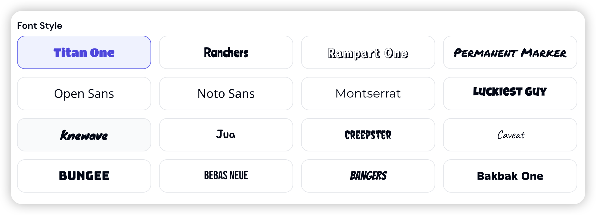

# Faceless Video Generator 

---
> ## 🎬 Special Offer from FacelessVideos.app!
> 
> ### Create Professional Faceless Videos with AI - In One Click!
>
> ✨ **One-stop automated video creation platform:**
> - 🤖 Generate complete faceless videos from just text input
> - 🎨 Choose between Flux Schnell and Flux Dev AI models
> - 🎁 **Limited Time**: New users get 1000 FREE credits!
>
> [🚀 Start Creating Now →](https://facelessvideos.app/)
---

## Project Overview

Faceless Video Generator is a comprehensive multimedia content creation tool that streamlines the process of story generation, image generation, and video production. Users can generate various types of stories, create corresponding images, and compile these images and subtitles into a video.

## Demo


## Key Features

- **Story Generation**: Create complete stories based on user-specified story types, including Scary, Mystery, Bedtime, Interesting History, Urban Legends, Motivational, Fun Facts, Long Form Jokes, Life Pro Tips, Philosophy, Love, and Custom Topics.
- **Image Generation**: Produce images based on story scenes using AI image generation models.
- **Video Production**: Combine generated images and subtitles into a video with selectable voice options.
- **Multiple Story Types**: Support for various story types, each with tailored generation processes.
- **Character Generation**: For applicable story types, the system generates detailed character descriptions.
- **Customizable Image Styles**: Users can choose from different image styles like photorealistic, cinematic, anime, comic-book, and pixar-art.
- **Voice Selection**: Multiple voice options for audio generation.

## Installation

1. Clone the repository:

   ```bash
   git clone https://github.com/SmartClipAI/faceless-video-generator.git
   cd faceless-video-generator
   ```

2. Create and activate a virtual environment:

   ```bash
   # On Windows
   python -m venv venv
   .\venv\Scripts\activate

   # On macOS/Linux
   python -m venv venv
   source venv/bin/activate
   ```

3. Install project dependencies:

   ```bash
   pip install -r requirements.txt
   ```

4. Configure environment variables:
   Create a `.env` file in the project root directory with the following content:

   ```plaintext
   # Required: OpenAI API configuration for story generation
   OPENAI_BASE_URL=your_openai_base_url
   OPENAI_API_KEY=your_openai_api_key
   
   # Required: Replicate API token for default image generation
   REPLICATE_API_TOKEN=your_replicate_api_token
   
   # Optional: FAL API key if you want to use FAL for image generation
   # To use FAL, you'll need to modify src/main.py
   FAL_KEY=your_fal_api_key
   ```

   Note: The system uses Replicate for image generation by default. If you prefer to use FAL's image generation service, you can modify `src/main.py` accordingly.

## Usage

1. Activate the virtual environment (if not already activated):

   ```bash
   # On Windows
   .\venv\Scripts\activate

   # On macOS/Linux
   source venv/bin/activate
   ```

2. Run the main script:

   ```bash
   python src/main.py
   ```

3. Follow the prompts to:
   - Select a story type
   - Choose an image style
   - Pick a voice for audio generation

The script will automatically generate the story, images, and video.

## Project Structure

- `src/main.py`: Main script controlling the overall workflow.
- `src/story_generator.py`: Functions for generating stories, translations, and storyboards.
- `src/image_generator.py`: Functions for generating images.
- `src/video_creator.py`: Functions for creating videos.
- `src/audio_generator.py`: Functions for generating audio using OpenAI TTS.
- `src/utils.py`: Utility functions for various tasks.
- `src/transitions.py`: Video transition effects.
- `src/parse_json.py`: JSON parsing utilities.
- `config.json`: Configuration file for various settings.

## Configuration

The `config.json` file contains various settings for the project, including:

### Story Generation Settings
- `char_limit_min`: Minimum character count for generated stories (700)
- `char_limit_max`: Maximum character count for generated stories (800)

### Storyboard Settings
- `max_scenes`: Maximum number of scenes to generate for each story (14)

### OpenAI Settings
- `model`: The GPT model to use for story generation ("gpt-4")
- `temperature`: Creativity level for story generation (0.9, higher means more creative)

### Image Generation Settings
The project supports two image generation APIs:

#### Replicate Flux API Settings
- `model`: Image generation model ("black-forest-labs/flux-schnell")
- `aspect_ratio`: Output image aspect ratio ("9:16" for vertical videos)
- `num_inference_steps`: Number of denoising steps (4)
- `disable_safety_checker`: Safety filter toggle (false)
- `guidance`: How closely to follow the prompt (3.0)
- `output_quality`: Image quality setting (100)

#### FAL Flux API Settings
- `model`: Image generation model ("fal-ai/flux/schnell")
- `image_size`: Output image size ("portrait_16_9")
- `num_inference_steps`: Number of denoising steps (4)
- `guidance_scale`: How closely to follow the prompt (3.5)
- `enable_safety_checker`: Safety filter toggle (false)
- `num_images`: Number of images to generate per prompt (1)

### Text-to-Speech Settings
- `speech_rate`: Speed multiplier for generated speech (1.1)

You can modify these settings in the `config.json` file to customize the behavior of the application according to your needs.

## Supported Fonts



The application supports the following font styles for text rendering:

- Titan One
- Ranchers
- Rampart One
- Permanent Marker
- Open Sans
- Noto Sans
- Montserrat
- Luckiest Guy
- Knewave
- Jua
- Creepster
- Caveat
- Bungee
- Bebas Neue
- Bangers
- Bakbak One

These fonts can be used for customizing the text appearance in generated videos and images.

